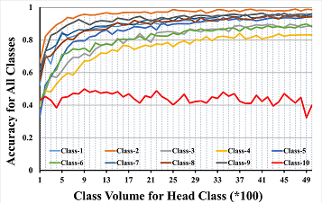
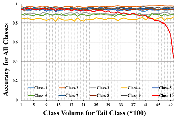
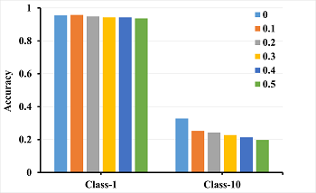

# This is the code for the paper "Investigate the Essence of Long-Tailed Recognition from a Unified Perspective".


This repository contains the implementation code for paper: <br>
__Investigate the Essence of Long-Tailed Recognition from a Unified Perspective__ <br>
[Lei Liu](CUHKSZ), and [Li Liu](CUHKSZ) <br>
_arxiv version_ <br>

If you find this code or idea useful, please consider citing our work:
```bib
@article{liu2021investigate,
  title={Investigate the Essence of Long-Tailed Recognition from a Unified Perspective},
  author={Liu, Lei and Liu, Li},
  journal={arXiv preprint arXiv:2107.03758},
  year={2021}
}
```

## Overview
In this work, we show theoretically and empirically that, both __sample number__ (imbalanced distribution) and __category similarity__ (similar data) should be responsible for the performance dropping for imbalanced (long-tailed) recognition, and interpret representative and classifier learning from a unified perspective.

__Toy Example__: 
Toy example is to show that sample number is not the unique influence factor of long-tailed recognition.

<table align="center"><tr>
<td></td>
<td></td>
</tr></table>


__A Unified Perspective for Long-Tailed Learning__:
In this section, through a simple theoretical model, we first make an intuition on how category similarity influences the classifier estimation via similar samples. With theoretical results, we skillful design verification experiments to confirm the negative effect of similar samples on performance dropping.

<table align="center"><tr>
<td></td>
<td></td>
</tr></table>

                                                       
__Understanding the Learning for Long-Tailed Recognition__:
Self-supervised pre-training is to help model learn discriminative features for the similar data.


## Installation

#### Prerequisites
- Download [CIFAR](https://www.cs.toronto.edu/~kriz/cifar.html). Original data will be converted by [`imbalance_cifar.py`](dataset/imbalance_cifar.py).
- Download [ImageNet](http://image-net.org/download) & [iNaturalist 2018](https://github.com/visipedia/inat_comp/tree/master/2018) dataset, and place them in your `data_path`. Long-tailed version will be created using train/val splits (.txt files) in corresponding subfolders under `imagenet_inat/data/`
- Change the `data_root` in [`imagenet_inat/main.py`](./imagenet_inat/main.py) accordingly for ImageNet-LT & iNaturalist 2018

#### Dependencies
- PyTorch (= 1.2)


## Code Overview

#### Main Files
- [`train_classifier.py`](train_classifier.py): train the classifier with fixed parameters of feature extractor.
- [`train_feature.py`](train_feature.py): train the feature extractor with (or without) SSP.
- [`imagenet_inat/main.py`](./imagenet_inat/main.py): train model with (or without) SSP, on ImageNet-LT / iNaturalist 2018.
- [`verification/imbalance_cifar.py`](./verification/imbalance_cifar.py): generate imbalanced and similar data for majority classes.
- [`pretrain_rot.py`](pretrain_rot.py) & [`pretrain_moco.py`](pretrain_moco.py): self-supervised pre-training using [Rotation prediction](https://arxiv.org/pdf/1803.07728.pdf) or [MoCo](https://arxiv.org/abs/1911.05722). This part is refer to [Rethinking the Value of Labels for Improving Class-Imbalanced Learning].(https://github.com/YyzHarry/imbalanced-semi-self).

#### Main Arguments
- `--dataset`: name of chosen long-tailed dataset
- `--imb_factor`: imbalance factor (inverse value of imbalance ratio `\rho` in the paper)
- `--imb_factor_unlabel`: imbalance factor for unlabeled data (inverse value of unlabel imbalance ratio `\rho_U`)
- `--pretrained_model`: path to self-supervised pre-trained models
- `--resume`: path to resume checkpoint (also for evaluation)


## Getting Started

### Toy Example Learning

#### data sourcing

__CIFAR-10-LT__: CIFAR-10 unlabeled data is prepared following [this repo](https://github.com/yaircarmon/semisup-adv) using the [80M TinyImages](https://people.csail.mit.edu/torralba/publications/80millionImages.pdf). 

#### Setting

To conduct the Toy Example (case 1), first  is to fix the sample number for the 10-th class, while the sample number for each top-9 class is manually increased from 100 to 5,000 with the step of 100. 

To conduct the Toy Example (case 2), first  is to fix the sample number for each top-9 class, while the sample number for the 10-th class is manually decreased from 5,000 to 100 with the step of 100. 

#### Main Results
The results are shown in the following tables.


<table align="center"><tr>
<td></td>
<td></td>
</tr></table>

                                                   
### Verification Experiment

#### Setting
To demonstrate this theoretical finding experimentally, we skillfully construct some virtual similar samples with the help of [mixup](https://arxiv.org/abs/1710.09412).

#### Main Results
The results are shown in the following table.

<table align="center"><tr>
<td></td>
</tr></table>

                                                 
### Self-Supervised pretraining

#### Setting
This part is refer to [Rethinking the Value of Labels for Improving Class-Imbalanced Learning]

#### Main Results
The results are shown in the following table.


<table align="center"><tr>
<td></td>
</tr></table>


                                                 
### Different Architectures

#### Main Results


<table align="center"><tr>
<td></td>
</tr></table>


## Contact
If you have any questions, feel free to contact us through email (leiliu@link.cuhk.edu.cn) or Github issues.
